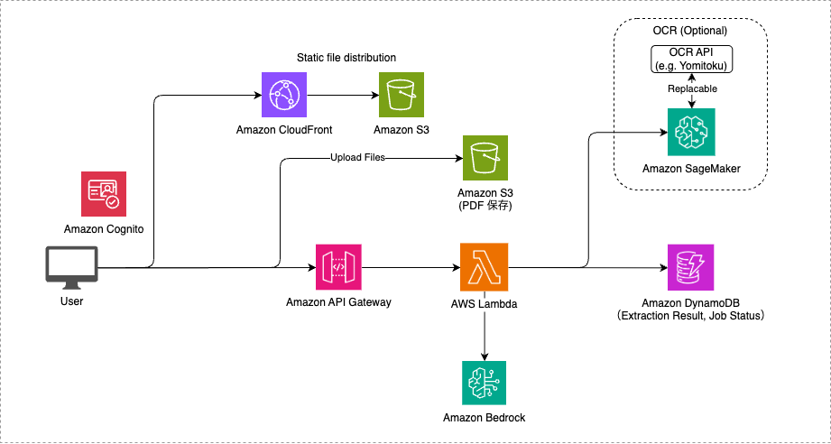

# AutoExtract

AutoExtract は OCR + Bedrock を活用した帳票読み取りの AI-OCR ソリューションです。

デモ（OCR エンジンとして Yomitoku を使用）


## アーキテクチャ



## デプロイ手順

デプロイの際は、事前に Node.js、Docker のインストールが必要です。

### Bedrock モデルのセットアップ

1. AWS コンソールにログインし、Bedrock サービスに移動
2. リージョンを `バージニア北部（us-east-1）` に変更
3. 以下のモデルへのアクセスを有効化：

- Anthropic Claude Sonnet 4

#### 使用するモデルの変更

`cdk.json` にて、使用する Bedrock モデルの ID とリージョンを指定することができます。モデルの ID は [Amazon Bedrock でサポートされている基盤モデル](https://docs.aws.amazon.com/ja_jp/bedrock/latest/userguide/models-supported.html) を参照してください。また、使用するモデルを変更する場合は、上記のステップと同様にモデルアクセスを有効化する必要があります。

```
"model_id": "us.anthropic.claude-sonnet-4-20250514-v1:0",
"model_region": "us-east-1",
```

### CDK による AWS リソースのデプロイ

CDK デプロイの際に必要な依存パッケージのインストールします。

```sh
npm ci
```

新規の AWS アカウント/リージョンで初めて CDK を使用する場合は、以下のコマンドを実行してください。

```sh
cdk bootstrap
```

AWS リソースのデプロイを行います。リソースの変更を行った際は毎回このコマンドを実行してください。

```sh
cdk deploy
```

デプロイ後に出力される `OcrAppStack.WebConstructCloudFrontURL` の URL にアクセスすることで、Web サイトにアクセスできます。

### AWS リソースの削除

削除するとリソースとデータは完全に消去されるので注意してください。

```sh
cdk destroy
```

## OCR エンジンの変更

デフォルトでは OCR エンジンとして PaddleOCR を利用していますが、高精度の日本語 OCR エンジン「Yomitoku」に切り替えることも可能です。[AWS Marketplace](https://aws.amazon.com/marketplace/pp/prodview-64qkuwrqi4lhi) からサブスクライブした後、利用することが可能です。利用方法としては、[ocr.py](lambda/api/app/ocr.py#L36) における SageMaker Endpoint の呼び出しにおいて、Yomitoku の SageMaker Endpoint を指定します。また、[Inference Component](lambda/api/app/ocr.py#L40) の記述をコメントアウトする必要があります。

### 開発方法

#### ローカルでの開発手順

1. 環境変数の設定

`cdk deploy` コマンドの実行後、出力されるリソース情報を利用してアプリケーションの環境変数を設定します。

出力例:

```
Outputs:
OcrAppStack.ApiApiEndpointE2C5D803 = https://XXXXXXXXXXXX.execute-api.us-east-2.amazonaws.com/prod/
OcrAppStack.ApiDocumentBucketName14F33E89 = ocrappstack-apidocumentbucket1e0f08d4-XXXXXXXXXXXX
OcrAppStack.ApiImagesTableName87FC28D3 = OcrAppStack-DatabaseImagesTable3098F792-XXXXXXXXXXXX
OcrAppStack.ApiJobsTableName16618860 = OcrAppStack-DatabaseJobsTable7C20F61C-XXXXXXXXXXXX
OcrAppStack.ApiOcrApiEndpoint94C64180 = https://XXXXXXXXXXXX.execute-api.us-east-2.amazonaws.com/prod/
OcrAppStack.AuthUserPoolClientId8216BF9A = XXXXXXXXXXXX
OcrAppStack.AuthUserPoolIdC0605E59 = us-east-2_XXXXXXXXXXXX
OcrAppStack.DatabaseImagesTableName88591548 = OcrAppStack-DatabaseImagesTable3098F792-XXXXXXXXXXXX
OcrAppStack.DatabaseJobsTableNameFCF442A2 = OcrAppStack-DatabaseJobsTable7C20F61C-XXXXXXXXXXXX
OcrAppStack.DatabaseSchemasTableNameCF14F20C = OcrAppStack-DatabaseSchemasTable97CF304A-XXXXXXXXXXXX
OcrAppStack.OcrEndpointDockerImageUriDFE2281D = XXXXXXXXXXXX.dkr.ecr.us-east-2.amazonaws.com/cdk-hnb659fds-container-assets-XXXXXXXXXXXX-us-east-2:XXXXXXXXXXXX
OcrAppStack.OcrEndpointSageMakerEndpointName031E6036 = OcrEndpointEFA18CB8-XXXXXXXXXXXX
OcrAppStack.OcrEndpointSageMakerInferenceComponentNameAD008265 = ocr-inference-component
OcrAppStack.OcrEndpointSageMakerRoleArn4F9772E2 = arn:aws:iam::XXXXXXXXXXXX:role/OcrAppStack-OcrEndpointSageMakerExecutionRoleF2F0DF-XXXXXXXXXXXX
OcrAppStack.WebConstructCloudFrontURL2550F65B = https://XXXXXXXXXXXX.cloudfront.net
Stack ARN:
arn:aws:cloudformation:us-east-2:XXXXXXXXXXXX:stack/OcrAppStack/XXXXXXXXXXXX-XXXX-XXXX-XXXX-XXXXXXXXXXXX
```

この出力情報を基に、プロジェクトルートの `web` ディレクトリにある `.env.sample` ファイルを参考にして、新規に `.env` ファイルを作成します。

2. 環境変数ファイルの設定例

`.env.sample` ファイルをコピーして `.env` ファイルを作成し、以下のように `cdk deploy` の出力値を使って設定します：

```properties
VITE_APP_USER_POOL_CLIENT_ID=XXXXXXXXXXXX                # AuthUserPoolClientId の値
VITE_APP_USER_POOL_ID=us-east-2_XXXXXXXXXXXX            # AuthUserPoolId の値
VITE_APP_REGION=us-east-2                               # リージョン名（デプロイしたリージョン）
VITE_API_BASE_URL=https://XXXXXXXXXXXX.execute-api.us-east-2.amazonaws.com/prod/   # ApiOcrApiEndpoint の値
VITE_ENABLE_OCR=true                                    # OCR機能の有効化
```

3. ローカル開発サーバーの起動

環境変数の設定が完了したら、以下のコマンドでローカル開発サーバーを起動できます：

```bash
cd web
npm install
npm run dev
```

ブラウザで `http://localhost:3000` を開くと、アプリケーションにアクセスできます。
